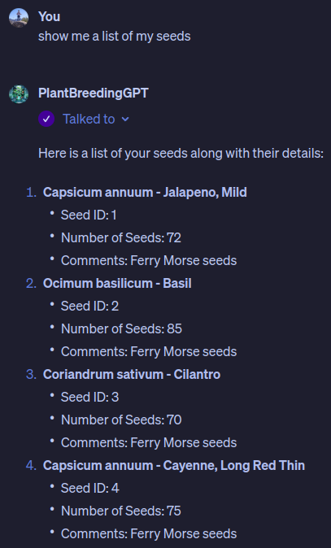

# 🌿 PlantBreedingGPT 🌿

PlantBreedingGPT is your digital gardening companion that roots a MySQL database and API on the cloud, 
allowing a custom GPT in ChatGPT to tend to your data garden through REST API calls. 
Designed for AWS RDS and Lambda with FastAPI, this template is a fun, experimental project tailored to my personal grow operation.

## 📷 Screenshots

  

## 🛠 Usage Instructions

### 🌱 Prerequisites

Make sure you're equipped with:

* AWS account
* AWS CLI
* SAM CLI
* Python 3.11

### 🚀 Planting the Seeds (Deploying)

1. **Clone the repository:** Pick the choicest code cuttings for your garden.
1. **Deploy your garden:**
    ```markdown
    sam sync --parameter-overrides DbPassword="your-db-password" ApiKey="your-api-key" --stack-name plants-stack
    ```
    Don't forget to replace `your-db-password` and `your-api-key` with your actual secrets.
2. With the URL that SAM CLI outputs, you can now make API calls to your garden!
3. In ChatGPT, you can now create a custom GPT that calls your garden's API. Import the OpenAPI spec from `<your url>/openapi.json`.
4. Use provided instructions (chatgpt-instructions.md) to set up your custom GPT in ChatGPT.
4. 🌱 **Plant your seeds!** 🌱

### 📚 Database Overview

Here's the structure of your PlantBreedingGPT's knowledge base (more details in api/models.py):

- 🌱 `germination`: Records seed germination details, including dates and methods.
- 💧 `hydroponic_system`: Describes different hydroponic systems and their characteristics.
- 📊 `hydroponic_conditions`: Tracks water conditions in hydroponic systems over time.
- 🌺 `plant_crosses`: Details the process and results of plant crossbreeding efforts.
- 🌿 `plants`: Catalogs plants, linking them to their germination and hydroponic system details.
- 📈 `observations`: Logs regular observations of plant growth and health indicators.
- 🤝 `plant_plant_cross`: Connects plants to their crossbreeding events and roles.
- 🍽️ `taste_test`: Assesses the taste, texture, and appearance of plants.
- 📦 `yield`: Records harvested plant yields, their characteristics, and related crossbreeding info.
- 🌾 `seeds`: Keeps inventory of seeds, including counts and varieties.
